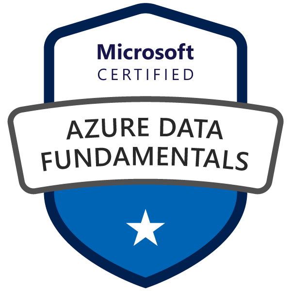
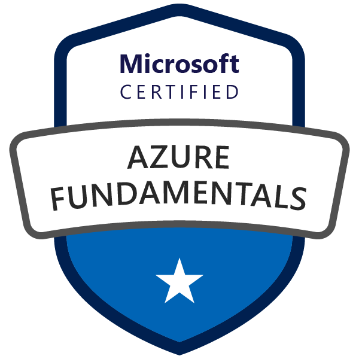
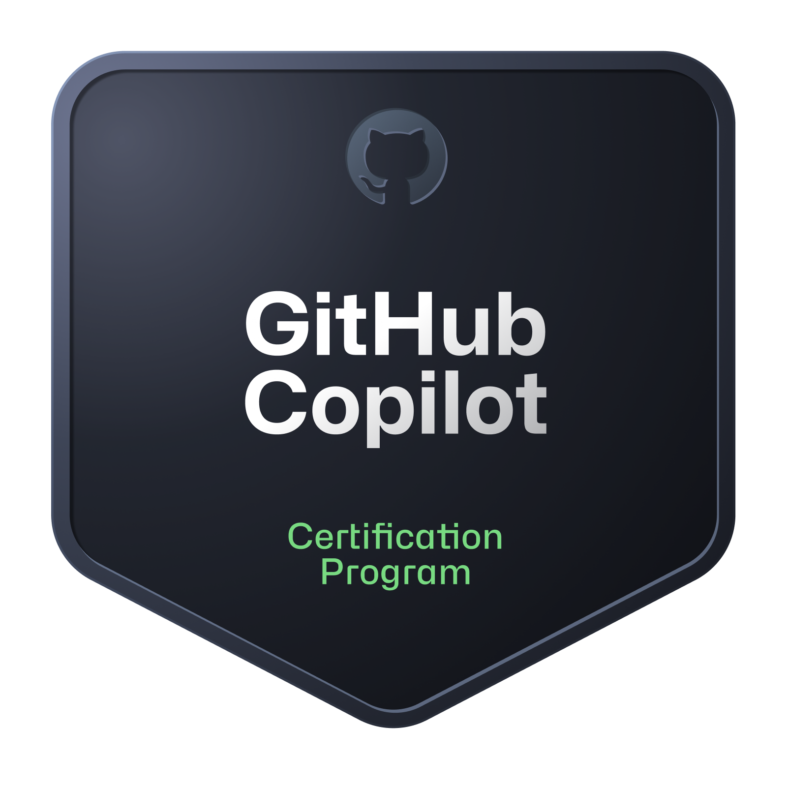

<h1 align="center">Hey 👋, I'm Anantha Sai Jinde</h1>

Azure Data Engineer who enjoys building reliable, scalable data systems on the cloud. I spend most of my time working with Azure Data Factory, Databricks, PySpark, and SQL — engineering data pipelines, writing transformation logic, and figuring out ways to make things run smoother and faster. When I'm not working on production systems, I like picking up real-world datasets and building end-to-end data engineering projects from scratch.

Lately, I've been curious about how data engineering and AI come together — and that's the direction I'm heading next.

## 🛠️ Tech Stack

**Languages & Processing**

**Azure Cloud & Data Services**

**Data Engineering & Architecture**

**DevOps & Version Control**

## 🏅 Certifications

  
  &nbsp;
  
  &nbsp;
  
  &nbsp;
  
  &nbsp;
  
  &nbsp;
  
  &nbsp;
  
  &nbsp;
  

## 📂 Explore My Work

Take a look at my pinned repositories below — each one is a hands-on data engineering project built from scratch.

## 📫 Connect With Me

=======
